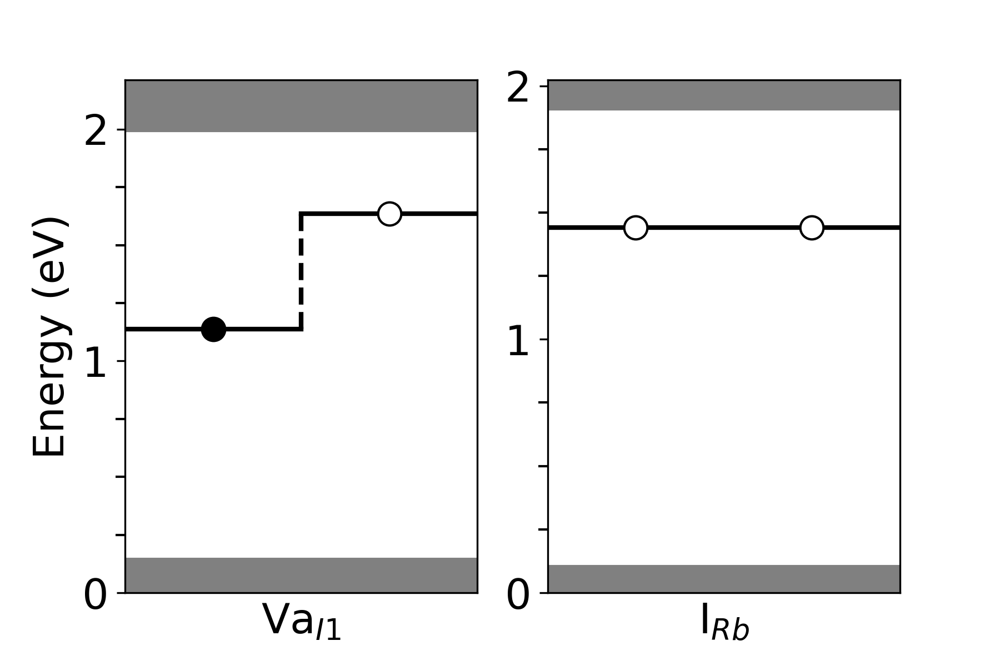
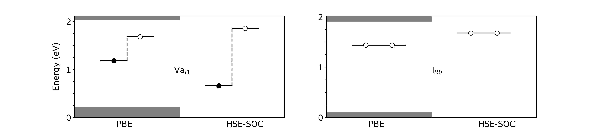

# Defect-Band-Visualization
This repository includes python codes to plot defect bands across the band gap for DFT and Hybrid functionals. The scripts currently default to displaying PBE and HSE but these can be adjusted accordingly.

This respository includes examples of input scrips as well as python codes that can be run on spyder or other ide. The codes can also be run directly in the terminal if a python/anaconda module is loaded.

The example files need to be specified with the fileloc tag or the file name will need to be changed to work properly.

## defect_band_seperate.py
### Description
This script produces seperate plots for each defect. You can use the tags to display PBE band gaps relative to the HSE band gaps.

### Test Files
The hse_example.txt file is an example to use without the -hseext tag. This will indivdually display the plots without any grey region.  
The pbe_hse_edges_example.txt is used to indvidually display the defects with the grey region showing the HSE extended region and the white region displaying the PBE. This can be done by setting the -hseext tag to True.

### Sample Images
#### No HSEEXT Tag  

#### HSEEXT Tag Enabled  

## defect_band_combined.py
### Description
This script produces indicuadlly plots comparing the pure PBE rsults to the HSE results. The PBE data should contain the band edges of the HSE region. The PBE data should be before the HSE data.

### Test Files
The combined_example.txt is an example of the input file. There are no additional tags needed. Although I would recommend setting the plotwidth tag to 12 (generally 6 per defect).

### Sample Image  

